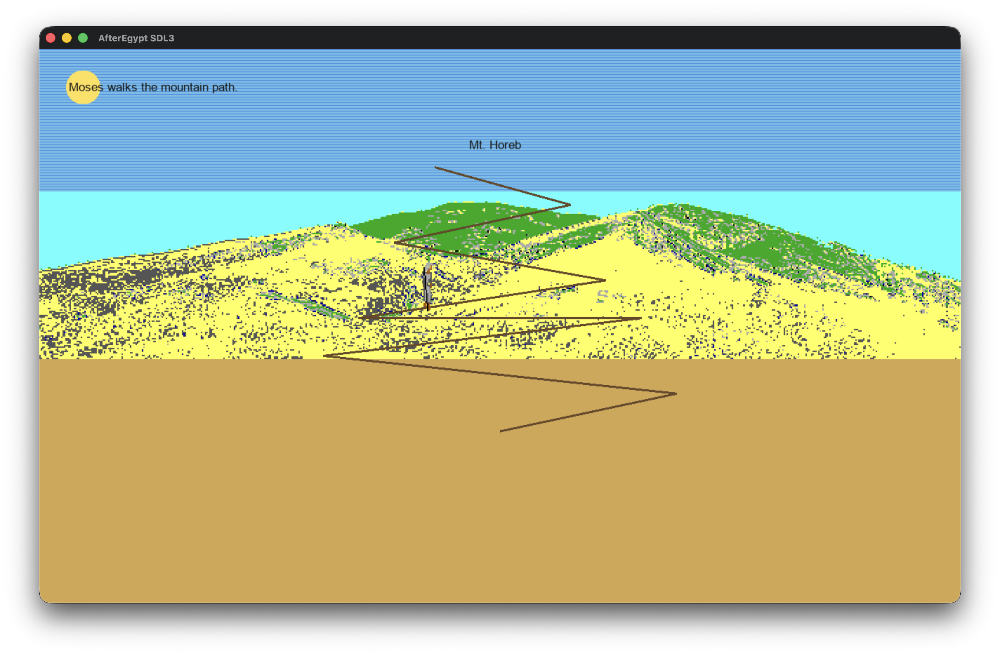
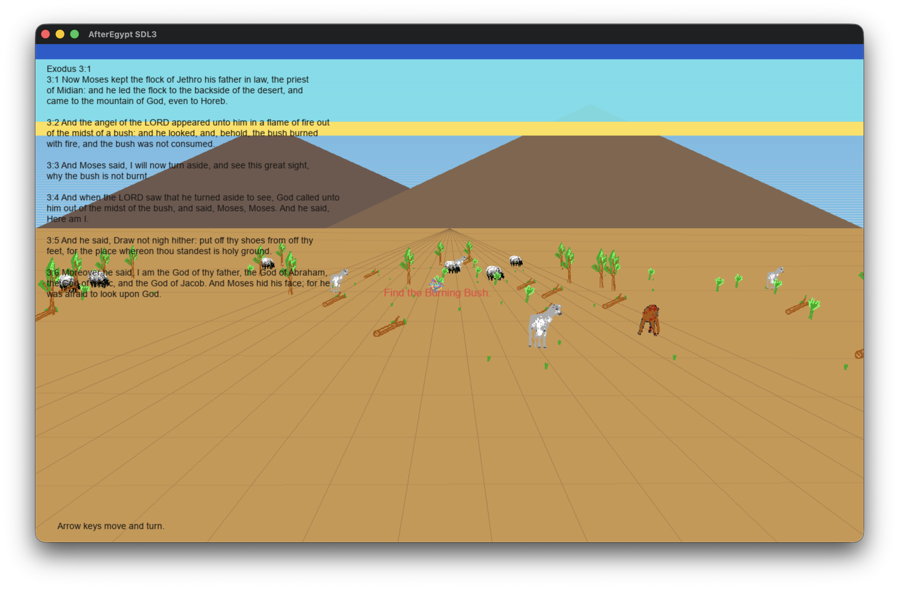

# AfterEgypt SDL3

Native SDL3 port of TinkerOS `Apps/AfterEgypt`.

The original is a small TempleOS-style app suite with embedded `.DD` sprite
blobs. This port keeps the trailer, original camp-before-menu turn loop,
music/sound, activity scenes, Bible/document screens, and runtime decoding of
the embedded TempleOS sprite records from the bundled `assets/AfterEgypt`
files.

## Screenshots



Moses climbs the mountain path before the interactive Horeb scene.



The Horeb scene uses arrow-key movement, Bible text, and the original sprite
blobs while searching for the burning bush.

## Build

```sh
brew install sdl3 sdl3_ttf
cmake -S . -B build
cmake --build build
```

## Run

```sh
./build/after-egypt-sdl3
```

The app starts maximized as a normal resizable desktop window, not SDL
fullscreen.

Controls:

- The intro/trailer starts first. It advances after the original message cycle;
  click or press any key to skip ahead.
- Camp plays before the menu each turn. Press any key or click to open the
  menu. Break Camp simply advances to the next camp turn.
- Click full-screen menu buttons, or use 1-9/0 for the listed activities.
- Esc returns from an activity to the next camp turn. Q quits from the menu.
- Return or R restarts the current activity.
- M mutes or unmutes generated SDL audio. The main theme follows the original
  `SongTask` pitch and timing tokens; Clouds uses its original cloud song.
- Talk with God: the mountain climb leads to the interactive Horeb scene.
  Use arrow keys to move and turn until the burning bush is centered/nearby;
  Enter restarts Horeb and Esc returns. Finding the bush advances to original
  style God text.
- Water Rock: hold Space to lower the staff; water appears after the original
  short delay. Release Space to raise the staff; the water persists. Click
  performs one quick strike.
- Battle: hold Space to keep Moses' hands up. Releasing starts the quartic sag
  timer and shifts the three fighter sprites, matching the original toy
  mechanic. There is no score or win state.
- Court: click a judgment or press 1, 2, or 3.
- Quail: read/scroll the Numbers 11 passage first; Enter or Space begins the
  128-quail animation.
- Comics: select an original `.DD` file in the picker. Left/right changes files
  while viewing; Esc returns to the picker/menu.
- Help: shows the available original HSNotes content and the original popup
  note. Long documents scroll with the wheel, PageUp/PageDown, or arrows.

There is no win condition. Like the source app, this is a collection of small
interactive story scenes.

## Runtime Assets

The port includes the original AfterEgypt scene/comic assets in
`assets/AfterEgypt`, KJV Bible text in `assets/Bible.TXT`, and God/help text
sources in `assets/God`. Those local copies are preferred at runtime. Adjacent
TempleOS/TinkerOS checkout paths remain fallback search locations for
development.

## Smoke Tests

```sh
SDL_VIDEODRIVER=dummy SDL_AUDIODRIVER=dummy ./build/after-egypt-sdl3 --smoke-window
SDL_VIDEODRIVER=dummy SDL_AUDIODRIVER=dummy ./build/after-egypt-sdl3 --smoke-scenes
```

## License

Port code is dual-licensed under `MIT OR Unlicense`; see `LICENSE`.
Third-party and upstream notices are in `THIRD_PARTY_NOTICES.md`.
